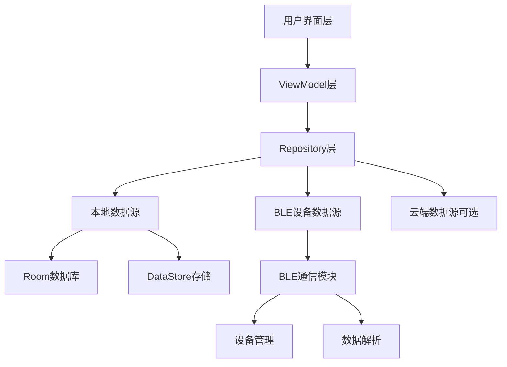

# 肾功能监测设备Android应用技术方案

## 1. 整体架构设计

### 1.1 架构模式
采用 **MVVM (Model-View-ViewModel)** 架构模式，结合 **Repository** 设计模式，实现数据与UI的分离，提高代码可测试性和可维护性。

### 1.2 核心模块

### 1.3 技术栈选择

| 类别 | 技术/库 | 版本 | 用途 |
|------|---------|------|------|
| 开发语言 | Kotlin | 1.8.0+ | 主要开发语言 |
| UI框架 | Jetpack Compose | 1.4.0+ | 现代化UI构建 |
| 架构组件 | ViewModel | 2.5.0+ | 数据状态管理 |
| 架构组件 | LiveData | 2.5.0+ | 数据观察 |
| 架构组件 | Room | 2.5.0+ | 本地数据库 |
| 架构组件 | DataStore | 1.0.0+ | 键值对存储 |
| 架构组件 | Navigation | 2.5.0+ | 页面导航 |
| 协程 | Kotlin Coroutines | 1.6.0+ | 异步操作 |
| 蓝牙 | Android BLE API | API 23+ | 设备通信 |
| 图表 | MPAndroidChart | 3.1.0+ | 数据可视化 |
| 安全 | SQLCipher | 4.5.0+ | 数据库加密 |
| 模糊效果 | Blurry | 3.0.0+ | 低版本模糊支持 |

## 2. 模块详细设计

### 2.1 BLE蓝牙通信模块

#### 2.1.1 功能需求
- 设备扫描与发现
- 设备连接与管理
- 服务与特征值发现
- 数据读写与通知
- MTU协商与分包传输
- 断线重连机制
- 权限管理

#### 2.1.2 核心类设计

| 类名 | 职责 |
|------|------|
| `BleManager` | 蓝牙管理核心类，处理扫描、连接等操作 |
| `BleDevice` | 设备模型，包含设备信息和操作方法 |
| `BleGattCallback` | GATT操作回调处理 |
| `BleOperationQueue` | 蓝牙操作队列管理 |
| `BleDataParser` | 数据解析器，处理设备返回的数据 |

#### 2.1.3 权限处理
- Android 6.0+：位置权限（用于BLE扫描）
- Android 12+：BLUETOOTH_SCAN、BLUETOOTH_CONNECT权限
- 后台同步：使用前台服务并显示通知

### 2.2 数据存储与管理模块

#### 2.2.1 本地存储
- **Room数据库**：存储测量历史数据、用户信息
- **DataStore**：存储用户设置、设备信息、应用配置

#### 2.2.2 数据模型

| 实体类 | 主要字段 |
|--------|----------|
| `Measurement` | id, userId, timestamp, eGFR, creatinine, bun, cystatinC, uricAcid, proteinuria, albuminuria, urineVolume, ckdStage |
| `User` | id, name, age, gender, height, weight, medicalHistory |
| `Device` | id, name, address, bondState, lastConnected |

#### 2.2.3 数据访问
- `MeasurementDao`：测量数据的CRUD操作
- `UserDao`：用户数据的CRUD操作
- `DeviceDao`：设备数据的CRUD操作
- `Repository`：统一数据访问层，整合本地和远程数据

### 2.3 UI界面设计

#### 2.3.1 主要页面
- **首页仪表盘**：卡片式布局，显示核心指标
- **详情页面**：历史数据列表和图表
- **设备管理页面**：BLE设备扫描与绑定
- **用户管理页面**：多用户切换与管理
- **设置页面**：应用配置与隐私设置

#### 2.3.2 交互设计
- 下拉刷新：手动触发设备数据同步
- 滑动切换：卡片间左右滑动
- 长按复制：长按数值复制到剪贴板
- 卡片旋转：3D翻转效果，显示额外信息
- 栈顶Activity模糊：半透明Activity背景模糊

#### 2.3.3 动效设计
- 渐入渐出效果：页面切换、列表项加载
- 平滑过渡：卡片滑动、旋转动画
- 微交互：按钮点击、状态变化反馈

### 2.4 图表展示模块

#### 2.4.1 图表类型
- 折线图：展示eGFR、肌酐等连续指标趋势
- 柱状图：展示尿蛋白、尿量等离散数据
- 环形图：展示eGFR相对正常下限的比例

#### 2.4.2 交互功能
- 缩放：双指缩放查看详细数据
- 滑动：左右滑动查看历史数据
- 点击：点击数据点显示详细信息
- 区间参考线：显示正常范围上下限

### 2.5 异常处理与通知机制

#### 2.5.1 异常检测
- 数值异常检测：基于医学参考范围
- 趋势异常检测：基于历史数据变化

#### 2.5.2 通知方式
- 弹窗提示：测量结果异常时
- 状态栏通知：后台同步结果
- 颜色编码：数值文本根据严重程度变色
- 解释气泡：点击指标名称显示科普解释

### 2.6 多设备与用户管理

#### 2.6.1 设备管理
- 设备扫描与发现
- 设备绑定与配对
- 多设备切换
- 设备状态监控

#### 2.6.2 用户管理
- 多用户档案创建与切换
- 用户信息编辑
- 数据隔离与权限控制

## 3. 数据流设计

### 3.1 数据采集流程
1. BLE扫描发现设备
2. 连接设备并发现服务
3. 订阅特征值通知
4. 接收设备数据
5. 解析数据并验证
6. 存储到本地数据库
7. 更新UI显示

### 3.2 数据展示流程
1. 从数据库加载历史数据
2. 计算趋势和统计信息
3. 生成图表数据
4. 渲染UI组件
5. 响应用户交互

### 3.3 数据同步流程
1. 定时或手动触发同步
2. 连接设备获取最新数据
3. 解析并存储数据
4. 检查异常并发送通知
5. 更新UI显示

## 4. 性能优化策略

### 4.1 内存优化
- 使用分页加载处理大量历史数据
- 合理使用缓存减少数据库查询
- 及时释放不再使用的资源

### 4.2 网络优化（如需云端同步）
- 使用批量同步减少网络请求
- 压缩数据减少传输量
- 合理设置同步频率

### 4.3 UI优化
- 使用RecyclerView实现高效列表
- 图表渲染优化，避免卡顿
- 合理使用动画，避免过度绘制

### 4.4 蓝牙通信优化
- 优化扫描策略，减少电量消耗
- 使用MTU协商提高传输效率
- 实现操作队列，避免并发操作冲突

## 5. 测试方案

### 5.1 单元测试
- 数据解析逻辑测试
- 业务规则验证测试
- 异常处理测试

### 5.2 UI测试
- 页面导航测试
- 用户交互测试
- 响应式布局测试

### 5.3 蓝牙功能测试
- 设备扫描与连接测试
- 数据传输测试
- 断线重连测试
- 多设备切换测试

### 5.4 兼容性测试
- 不同Android版本测试
- 不同厂商设备测试
- 不同屏幕尺寸测试

## 6. 安全与隐私

### 6.1 数据安全
- 本地数据库加密（SQLCipher）
- 敏感数据传输加密
- 应用权限最小化

### 6.2 隐私保护
- 符合医疗隐私法规（HIPAA/GDPR）
- 用户数据本地存储为主
- 明确的隐私政策和数据使用说明
- 所有数据页面包含免责声明

## 7. 部署与维护

### 7.1 版本管理
- 语义化版本控制
- 功能分支管理
- 发布流程规范

### 7.2 维护策略
- 错误日志收集与分析
- 用户反馈渠道
- 定期更新与bug修复

## 8. 开发计划

### 8.1 阶段划分
1. 准备阶段：环境搭建、技术选型
2. 核心功能开发：BLE通信、数据存储
3. UI开发：界面实现、交互设计
4. 功能测试：单元测试、集成测试
5. 兼容性测试：多设备适配
6. 发布准备：性能优化、安全审查
7. 上线与维护：应用发布、用户反馈处理

### 8.2 关键里程碑
- BLE通信功能完成
- 核心数据存储实现
- 首页仪表盘开发完成
- 图表展示功能实现
- 多设备与用户管理功能完成
- 应用发布

## 9. 技术风险与应对策略

| 风险 | 应对策略 |
|------|----------|
| 蓝牙兼容性问题 | 针对不同厂商设备进行适配测试，实现统一的错误处理机制 |
| 数据解析错误 | 实现数据验证和错误处理，确保数据准确性 |
| 电量消耗过大 | 优化蓝牙扫描策略，使用前台服务合理管理连接 |
| UI性能问题 | 优化图表渲染，使用分页加载，避免主线程阻塞 |
| 隐私合规问题 | 严格遵守医疗数据隐私法规，实现数据加密和访问控制 |

## 10. 结论

本技术方案基于现代Android开发最佳实践，采用MVVM架构和Jetpack组件，实现了一个功能完整、性能优化、安全可靠的肾功能监测应用。通过合理的模块划分和数据流设计，确保了应用的可扩展性和可维护性。同时，针对医疗应用的特殊性，特别关注了数据安全和隐私保护，确保符合相关法规要求。