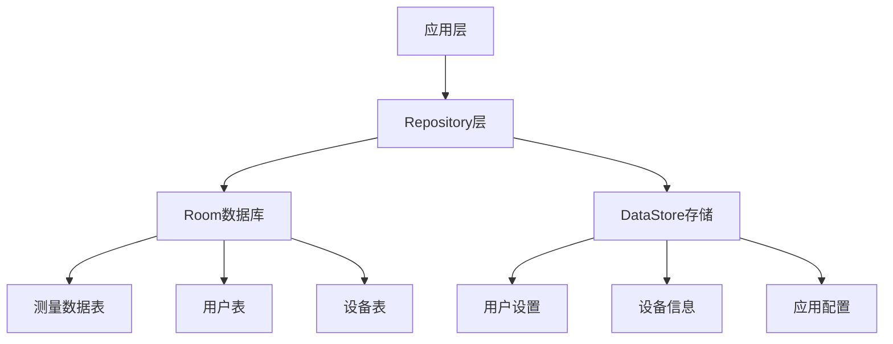

# 数据存储与管理方案

## 1. 存储架构

采用 **Room数据库** 存储结构化数据，**DataStore** 存储键值对配置信息，实现数据的持久化存储和管理。同时，使用 **SQLCipher** 对数据库进行加密，确保数据安全。



## 2. Room数据库设计

### 2.1 依赖配置

```gradle
dependencies {
    // Room依赖
    implementation "androidx.room:room-runtime:2.5.0"
    kapt "androidx.room:room-compiler:2.5.0"
    implementation "androidx.room:room-ktx:2.5.0"
    
    // SQLCipher加密
    implementation "net.zetetic:sqlcipher-android:4.5.0"
    implementation "androidx.sqlite:sqlite-ktx:2.3.0"
}
```

### 2.2 数据库加密配置

```kotlin
class EncryptedRoomDatabase : RoomDatabase() {
    companion object {
        fun getInstance(context: Context, password: String): EncryptedRoomDatabase {
            return Room.databaseBuilder(
                context,
                EncryptedRoomDatabase::class.java,
                "renalytics.db"
            )
                .openHelperFactory(SupportFactory(password.toByteArray()))
                .build()
        }
    }
    
    abstract fun measurementDao(): MeasurementDao
    abstract fun userDao(): UserDao
    abstract fun deviceDao(): DeviceDao
}
```

### 2.3 数据模型

#### 2.3.1 测量数据表 (Measurement)

```kotlin
@Entity(tableName = "measurements")
data class Measurement(
    @PrimaryKey(autoGenerate = true)
    val id: Long = 0,
    
    val userId: Long,
    
    @ColumnInfo(name = "timestamp")
    val timestamp: Long,
    
    @ColumnInfo(name = "egfr")
    val eGFR: Float,
    
    @ColumnInfo(name = "creatinine")
    val creatinine: Float,
    
    @ColumnInfo(name = "bun")
    val bun: Float,
    
    @ColumnInfo(name = "cystatin_c")
    val cystatinC: Float,
    
    @ColumnInfo(name = "uric_acid")
    val uricAcid: Float,
    
    @ColumnInfo(name = "proteinuria")
    val proteinuria: Float,
    
    @ColumnInfo(name = "albuminuria")
    val albuminuria: Float,
    
    @ColumnInfo(name = "urine_volume")
    val urineVolume: Float,
    
    @ColumnInfo(name = "ckd_stage")
    val ckdStage: Int,
    
    @ColumnInfo(name = "device_id")
    val deviceId: String
)
```

#### 2.3.2 用户表 (User)

```kotlin
@Entity(tableName = "users")
data class User(
    @PrimaryKey(autoGenerate = true)
    val id: Long = 0,
    
    val name: String,
    
    val age: Int,
    
    val gender: String,
    
    val height: Float, // 单位：cm
    
    val weight: Float, // 单位：kg
    
    @ColumnInfo(name = "medical_history")
    val medicalHistory: String,
    
    @ColumnInfo(name = "is_default")
    val isDefault: Boolean = false
)
```

#### 2.3.3 设备表 (Device)

```kotlin
@Entity(tableName = "devices")
data class Device(
    @PrimaryKey(autoGenerate = true)
    val id: Long = 0,
    
    val name: String,
    
    val address: String,
    
    @ColumnInfo(name = "bond_state")
    val bondState: Int,
    
    @ColumnInfo(name = "last_connected")
    val lastConnected: Long,
    
    @ColumnInfo(name = "is_default")
    val isDefault: Boolean = false
)
```

### 2.4 DAO接口

#### 2.4.1 测量数据DAO (MeasurementDao)

```kotlin
@Dao
interface MeasurementDao {
    @Insert
    suspend fun insert(measurement: Measurement): Long
    
    @Update
    suspend fun update(measurement: Measurement)
    
    @Delete
    suspend fun delete(measurement: Measurement)
    
    @Query("SELECT * FROM measurements WHERE user_id = :userId ORDER BY timestamp DESC")
    fun getMeasurementsByUserId(userId: Long): Flow<List<Measurement>>
    
    @Query("SELECT * FROM measurements WHERE user_id = :userId ORDER BY timestamp DESC LIMIT 1")
    suspend fun getLatestMeasurementByUserId(userId: Long): Measurement?
    
    @Query("SELECT * FROM measurements WHERE user_id = :userId AND timestamp BETWEEN :startTime AND :endTime ORDER BY timestamp ASC")
    suspend fun getMeasurementsByTimeRange(userId: Long, startTime: Long, endTime: Long): List<Measurement>
    
    @Query("DELETE FROM measurements WHERE user_id = :userId")
    suspend fun deleteMeasurementsByUserId(userId: Long)
}
```

#### 2.4.2 用户DAO (UserDao)

```kotlin
@Dao
interface UserDao {
    @Insert
    suspend fun insert(user: User): Long
    
    @Update
    suspend fun update(user: User)
    
    @Delete
    suspend fun delete(user: User)
    
    @Query("SELECT * FROM users")
    fun getAllUsers(): Flow<List<User>>
    
    @Query("SELECT * FROM users WHERE id = :userId")
    suspend fun getUserById(userId: Long): User?
    
    @Query("SELECT * FROM users WHERE is_default = 1")
    suspend fun getDefaultUser(): User?
    
    @Query("UPDATE users SET is_default = 0 WHERE is_default = 1")
    suspend fun clearDefaultUser()
}
```

#### 2.4.3 设备DAO (DeviceDao)

```kotlin
@Dao
interface DeviceDao {
    @Insert
    suspend fun insert(device: Device): Long
    
    @Update
    suspend fun update(device: Device)
    
    @Delete
    suspend fun delete(device: Device)
    
    @Query("SELECT * FROM devices")
    fun getAllDevices(): Flow<List<Device>>
    
    @Query("SELECT * FROM devices WHERE address = :address")
    suspend fun getDeviceByAddress(address: String): Device?
    
    @Query("SELECT * FROM devices WHERE is_default = 1")
    suspend fun getDefaultDevice(): Device?
    
    @Query("UPDATE devices SET is_default = 0 WHERE is_default = 1")
    suspend fun clearDefaultDevice()
}
```

## 3. DataStore存储

### 3.1 依赖配置

```gradle
dependencies {
    // DataStore依赖
    implementation "androidx.datastore:datastore-preferences:1.0.0"
}
```

### 3.2 数据存储键定义

```kotlin
object DataStoreKeys {
    // 用户设置
    val USER_ID = intPreferencesKey("user_id")
    val DEVICE_ID = stringPreferencesKey("device_id")
    val NOTIFICATION_ENABLED = booleanPreferencesKey("notification_enabled")
    val SYNC_INTERVAL = intPreferencesKey("sync_interval") // 单位：分钟
    
    // 应用配置
    val FIRST_LAUNCH = booleanPreferencesKey("first_launch")
    val THEME_MODE = stringPreferencesKey("theme_mode")
    val LANGUAGE = stringPreferencesKey("language")
    
    // 设备信息
    val LAST_SYNC_TIME = longPreferencesKey("last_sync_time")
    val MTU_SIZE = intPreferencesKey("mtu_size")
}
```

### 3.3 DataStore工具类

```kotlin
class DataStoreManager(private val context: Context) {
    private val dataStore = context.createDataStore(name = "app_preferences")
    
    // 保存数据
    suspend fun <T> save(key: Preferences.Key<T>, value: T) {
        dataStore.edit { preferences ->
            preferences[key] = value
        }
    }
    
    // 读取数据
    suspend fun <T> read(key: Preferences.Key<T>, defaultValue: T): T {
        val preferences = dataStore.data.first()
        return preferences[key] ?: defaultValue
    }
    
    // 监听数据变化
    fun <T> observe(key: Preferences.Key<T>, defaultValue: T): Flow<T> {
        return dataStore.data.map {
            it[key] ?: defaultValue
        }
    }
    
    // 删除数据
    suspend fun <T> remove(key: Preferences.Key<T>) {
        dataStore.edit { preferences ->
            preferences.remove(key)
        }
    }
}
```

## 4. Repository层

### 4.1 测量数据Repository

```kotlin
class MeasurementRepository(private val measurementDao: MeasurementDao) {
    // 插入测量数据
    suspend fun insertMeasurement(measurement: Measurement): Long {
        return measurementDao.insert(measurement)
    }
    
    // 更新测量数据
    suspend fun updateMeasurement(measurement: Measurement) {
        measurementDao.update(measurement)
    }
    
    // 删除测量数据
    suspend fun deleteMeasurement(measurement: Measurement) {
        measurementDao.delete(measurement)
    }
    
    // 获取用户的所有测量数据
    fun getMeasurementsByUserId(userId: Long): Flow<List<Measurement>> {
        return measurementDao.getMeasurementsByUserId(userId)
    }
    
    // 获取用户的最新测量数据
    suspend fun getLatestMeasurementByUserId(userId: Long): Measurement? {
        return measurementDao.getLatestMeasurementByUserId(userId)
    }
    
    // 获取指定时间范围内的测量数据
    suspend fun getMeasurementsByTimeRange(userId: Long, startTime: Long, endTime: Long): List<Measurement> {
        return measurementDao.getMeasurementsByTimeRange(userId, startTime, endTime)
    }
    
    // 删除用户的所有测量数据
    suspend fun deleteMeasurementsByUserId(userId: Long) {
        measurementDao.deleteMeasurementsByUserId(userId)
    }
}
```

### 4.2 用户Repository

```kotlin
class UserRepository(private val userDao: UserDao) {
    // 插入用户
    suspend fun insertUser(user: User): Long {
        if (user.isDefault) {
            userDao.clearDefaultUser()
        }
        return userDao.insert(user)
    }
    
    // 更新用户
    suspend fun updateUser(user: User) {
        if (user.isDefault) {
            userDao.clearDefaultUser()
        }
        userDao.update(user)
    }
    
    // 删除用户
    suspend fun deleteUser(user: User) {
        userDao.delete(user)
    }
    
    // 获取所有用户
    fun getAllUsers(): Flow<List<User>> {
        return userDao.getAllUsers()
    }
    
    // 根据ID获取用户
    suspend fun getUserById(userId: Long): User? {
        return userDao.getUserById(userId)
    }
    
    // 获取默认用户
    suspend fun getDefaultUser(): User? {
        return userDao.getDefaultUser()
    }
    
    // 设置默认用户
    suspend fun setDefaultUser(userId: Long) {
        userDao.clearDefaultUser()
        val user = userDao.getUserById(userId)
        user?.let {
            userDao.update(it.copy(isDefault = true))
        }
    }
}
```

### 4.3 设备Repository

```kotlin
class DeviceRepository(private val deviceDao: DeviceDao) {
    // 插入设备
    suspend fun insertDevice(device: Device): Long {
        if (device.isDefault) {
            deviceDao.clearDefaultDevice()
        }
        return deviceDao.insert(device)
    }
    
    // 更新设备
    suspend fun updateDevice(device: Device) {
        if (device.isDefault) {
            deviceDao.clearDefaultDevice()
        }
        deviceDao.update(device)
    }
    
    // 删除设备
    suspend fun deleteDevice(device: Device) {
        deviceDao.delete(device)
    }
    
    // 获取所有设备
    fun getAllDevices(): Flow<List<Device>> {
        return deviceDao.getAllDevices()
    }
    
    // 根据地址获取设备
    suspend fun getDeviceByAddress(address: String): Device? {
        return deviceDao.getDeviceByAddress(address)
    }
    
    // 获取默认设备
    suspend fun getDefaultDevice(): Device? {
        return deviceDao.getDefaultDevice()
    }
    
    // 设置默认设备
    suspend fun setDefaultDevice(address: String) {
        deviceDao.clearDefaultDevice()
        val device = deviceDao.getDeviceByAddress(address)
        device?.let {
            deviceDao.update(it.copy(isDefault = true))
        }
    }
}
```

### 4.4 应用设置Repository

```kotlin
class AppSettingsRepository(private val dataStoreManager: DataStoreManager) {
    // 保存用户ID
    suspend fun saveUserId(userId: Int) {
        dataStoreManager.save(DataStoreKeys.USER_ID, userId)
    }
    
    // 获取用户ID
    suspend fun getUserId(): Int {
        return dataStoreManager.read(DataStoreKeys.USER_ID, -1)
    }
    
    // 监听用户ID变化
    fun observeUserId(): Flow<Int> {
        return dataStoreManager.observe(DataStoreKeys.USER_ID, -1)
    }
    
    // 保存设备ID
    suspend fun saveDeviceId(deviceId: String) {
        dataStoreManager.save(DataStoreKeys.DEVICE_ID, deviceId)
    }
    
    // 获取设备ID
    suspend fun getDeviceId(): String {
        return dataStoreManager.read(DataStoreKeys.DEVICE_ID, "")
    }
    
    // 保存通知开关状态
    suspend fun saveNotificationEnabled(enabled: Boolean) {
        dataStoreManager.save(DataStoreKeys.NOTIFICATION_ENABLED, enabled)
    }
    
    // 获取通知开关状态
    suspend fun getNotificationEnabled(): Boolean {
        return dataStoreManager.read(DataStoreKeys.NOTIFICATION_ENABLED, true)
    }
    
    // 保存同步间隔
    suspend fun saveSyncInterval(interval: Int) {
        dataStoreManager.save(DataStoreKeys.SYNC_INTERVAL, interval)
    }
    
    // 获取同步间隔
    suspend fun getSyncInterval(): Int {
        return dataStoreManager.read(DataStoreKeys.SYNC_INTERVAL, 30) // 默认30分钟
    }
    
    // 保存首次启动状态
    suspend fun saveFirstLaunch(firstLaunch: Boolean) {
        dataStoreManager.save(DataStoreKeys.FIRST_LAUNCH, firstLaunch)
    }
    
    // 获取首次启动状态
    suspend fun getFirstLaunch(): Boolean {
        return dataStoreManager.read(DataStoreKeys.FIRST_LAUNCH, true)
    }
    
    // 保存主题模式
    suspend fun saveThemeMode(themeMode: String) {
        dataStoreManager.save(DataStoreKeys.THEME_MODE, themeMode)
    }
    
    // 获取主题模式
    suspend fun getThemeMode(): String {
        return dataStoreManager.read(DataStoreKeys.THEME_MODE, "system")
    }
    
    // 保存语言
    suspend fun saveLanguage(language: String) {
        dataStoreManager.save(DataStoreKeys.LANGUAGE, language)
    }
    
    // 获取语言
    suspend fun getLanguage(): String {
        return dataStoreManager.read(DataStoreKeys.LANGUAGE, "auto")
    }
    
    // 保存最后同步时间
    suspend fun saveLastSyncTime(time: Long) {
        dataStoreManager.save(DataStoreKeys.LAST_SYNC_TIME, time)
    }
    
    // 获取最后同步时间
    suspend fun getLastSyncTime(): Long {
        return dataStoreManager.read(DataStoreKeys.LAST_SYNC_TIME, 0)
    }
    
    // 保存MTU大小
    suspend fun saveMtuSize(size: Int) {
        dataStoreManager.save(DataStoreKeys.MTU_SIZE, size)
    }
    
    // 获取MTU大小
    suspend fun getMtuSize(): Int {
        return dataStoreManager.read(DataStoreKeys.MTU_SIZE, 512)
    }
}
```

## 5. 数据同步与备份

### 5.1 本地数据同步

```kotlin
class LocalDataSyncManager(
    private val measurementRepository: MeasurementRepository,
    private val deviceRepository: DeviceRepository,
    private val appSettingsRepository: AppSettingsRepository
) {
    // 同步设备数据
    suspend fun syncDeviceData(measurementData: BleDataParser.MeasurementData, deviceAddress: String) {
        // 获取当前默认用户
        val userId = appSettingsRepository.getUserId().toLong()
        
        // 创建测量数据
        val measurement = Measurement(
            userId = userId,
            timestamp = System.currentTimeMillis(),
            eGFR = measurementData.eGFR,
            creatinine = measurementData.creatinine,
            bun = measurementData.bun,
            cystatinC = measurementData.cystatinC,
            uricAcid = measurementData.uricAcid,
            proteinuria = measurementData.proteinuria,
            albuminuria = measurementData.albuminuria,
            urineVolume = measurementData.urineVolume,
            ckdStage = measurementData.ckdStage,
            deviceId = deviceAddress
        )
        
        // 保存测量数据
        measurementRepository.insertMeasurement(measurement)
        
        // 更新设备最后连接时间
        val device = deviceRepository.getDeviceByAddress(deviceAddress)
        device?.let {
            deviceRepository.updateDevice(it.copy(lastConnected = System.currentTimeMillis()))
        }
        
        // 更新最后同步时间
        appSettingsRepository.saveLastSyncTime(System.currentTimeMillis())
    }
}
```

### 5.2 云端备份（可选）

如果需要实现云端备份功能，可使用Firebase或其他云服务：

```kotlin
class CloudBackupManager(private val firestore: FirebaseFirestore) {
    // 备份测量数据到云端
    suspend fun backupMeasurements(userId: Long, measurements: List<Measurement>) {
        val measurementsCollection = firestore.collection("users").document(userId.toString())
            .collection("measurements")
        
        measurements.forEach { measurement ->
            measurementsCollection.document(measurement.id.toString())
                .set(measurement.toMap())
                .await()
        }
    }
    
    // 从云端恢复测量数据
    suspend fun restoreMeasurements(userId: Long): List<Measurement> {
        val measurementsCollection = firestore.collection("users").document(userId.toString())
            .collection("measurements")
        
        val querySnapshot = measurementsCollection.get().await()
        return querySnapshot.documents.mapNotNull {
            it.toObject(Measurement::class.java)
        }
    }
}
```

## 6. 数据安全

### 6.1 数据库加密

使用SQLCipher对Room数据库进行加密，防止数据被窃取：

```kotlin
// 初始化加密数据库
val password = "your_secure_password"
val database = EncryptedRoomDatabase.getInstance(context, password)
```

### 6.2 敏感数据处理

- 所有健康数据均存储在本地加密数据库中
- 如需云端备份，使用HTTPS加密传输
- 应用权限最小化，只申请必要的权限
- 定期清理过期数据，减少数据泄露风险

### 6.3 隐私合规

- 符合医疗隐私法规（HIPAA/GDPR）
- 提供明确的隐私政策和数据使用说明
- 所有数据页面包含免责声明："仅用于参考，不可替代专业诊断"

## 7. 性能优化

### 7.1 数据库优化

- 使用索引加速查询
- 合理设计表结构，避免冗余字段
- 使用分页加载处理大量数据
- 批量操作减少数据库交互次数

### 7.2 缓存策略

- 使用内存缓存存储常用数据
- 实现数据预加载，提高响应速度
- 定期清理缓存，避免内存占用过高

### 7.3 后台操作

- 所有数据库操作在后台线程执行
- 使用协程管理异步任务
- 避免在主线程进行耗时操作

## 8. 测试策略

### 8.1 单元测试

- 测试DAO接口的CRUD操作
- 测试Repository层的业务逻辑
- 测试DataStore的读写操作

### 8.2 集成测试

- 测试数据库初始化和加密
- 测试数据同步流程
- 测试备份与恢复功能

### 8.3 性能测试

- 测试大量数据的插入和查询性能
- 测试数据库加密对性能的影响
- 测试不同设备上的存储性能

## 9. 结论

数据存储与管理方案采用Room数据库和DataStore相结合的方式，实现了结构化数据和配置信息的持久化存储。通过SQLCipher加密确保数据安全，符合医疗应用的隐私要求。同时，通过Repository层的设计，实现了数据访问的统一管理，提高了代码的可维护性和可测试性。在实际开发中，还需要根据应用的具体需求和使用场景，对存储方案进行进一步的优化和调整。